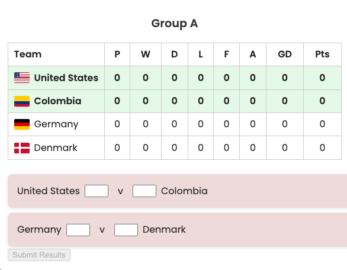

# 🏆 World Cup Tournament App

## 📚 Table of Contents

-   [Overview](#-overview)
-   [UI Flow](#-ui-flow)
-   [Logic Flow](#-logic-flow)
-   [Component Structure](#-component-structure)
-   [Data Shapes](#-data-shapes)
-   [Testing Strategy](#-testing-strategy)
-   [Dev Tools](#-dev-tools)

## 🧭 Overview

_A React-based simulation of a full World Cup — from regional qualifiers to the final!_

## 🏗️ Tech Stack


## 🎮 1. UI Flow

```↓ Regional
[Regional Qualifiers]
   ↓ Start Tournament
[Group Stage]
   ↓ Advance winners
[Knockout Stage]
   ↓ Play through Rounds
[Champion Announced 🎉]
```

---

## 🧩 2. Component Structure

```jsx
<App>
├── <RegionalQualifiers>   // Region-specific group tables
├── <Qualifiers />         // Displays all regional qualifier teams with flags
├── <GroupStage />         // Group tables and match inputs
├── <KnockoutStage />      // Bracket UI, match progression
│   └── <Match />          // Score input, extra time, penalties
      │   └── <TeamWithFlag /> // Shared component for team + flag
```

---

## ⚙️ 3. Logic Flow Summary

```
1. Fetch /teams.json on load
2. Shuffle teams → save in context

3. REGIONAL QUALIFIERS
   • Divide teams by region
   • Select regional winners

4. QUALIFIERS
   • Show winning teams (with flags)
   • "Start Tournament" button

5. GROUP STAGE
   • Assign to groups
   • Generate matches
   • Submit results
   • Update standings
   • Select top 2 + best third-placed teams

6. KNOCKOUT STAGE
   • createFirstKnockoutRound() avoids same-group clashes
   • Later rounds via createNextKnockoutRound()
   • Play matches: Regular → Extra Time (if draw)→ Penalties (if still draw)
   • Ends with 1 winner

8. Repeat until one champion remains

9. Display tournament winner 🎉

```

## 🧾 4. Data Shapes

### ✅ Team

```js
{
  name: 'Brazil',
  flag: 'https://flagpedia.net/data/flags/w320/br.png'
}
```

### ✅ Match

```js
{
	team1,
		team2,
		score1,
		score2,
		extraTimeScore1,
		extraTimeScore2,
		penaltyScore1,
		penaltyScore2,
		regularTimePlayed,
		extraTimePlayed,
		showExtraTime,
		showPenalties,
		onScoreChange;
}
```

### ✅ Group

```js
{
  groupName: 'A',
  teams: ['Brazil', 'Germany', 'France', 'Japan']
}
```

---

## ✅ Testing Strategy

-   Qualifiers: fetch test, display test, error fallback test
-   GroupStage: test group logic, test match rendering, submissions
-   KnockoutStage: test match results, advancing rounds, penalties and extra time
-   Match: score input, phase transition
-   Utility Functions: pure unit tests for shuffle, group, match creation

---

## 🚀 Getting Started

### 1. Install dependencies

npm install

### 2. Start local dev server

npm run dev

### 3. Run tests

npm run test

---

## 📸 Preview



## 🎯 Future Ideas

⚽ Add player stats per match

👕 Add kit images

🌐 Real-world team data from API

📱 Responsive styling improvements

---

## 🧠 Learnings

Although this project is far from finished yet (I've only got Asian teams in the Regional Qualifiers so far!! Where are all the other regions?! 😨)....

I'd like to be able to say that it was built using TDD methods, but that wouldn't be completely true. However I spent a lot of time (no blood, but definitely sweat and tears!) in testing every function at least as soon as it was written if not using the test to drive the development. I have come to realise that testing React apps (specifically the front end) is quite difficult. But I am getting used to what you can and can't test successfully and have (mostly) enjoyed the process. Seeing those test pass is very satisfying.

The project uses React component tests with Vitest + Testing Library, and follows clear logic separation between:

-   UI components (inputs, visuals)
-   Pure logic (fixtures, group stats, knockout logic)
-   Helper utilities (score handling, group sorting)

---

### 🏁 Author

Made with ❤️, 😅 and ☕ by [Emma](https://github.com/emjogale)  
Feel free to fork, star, or open an issue!
